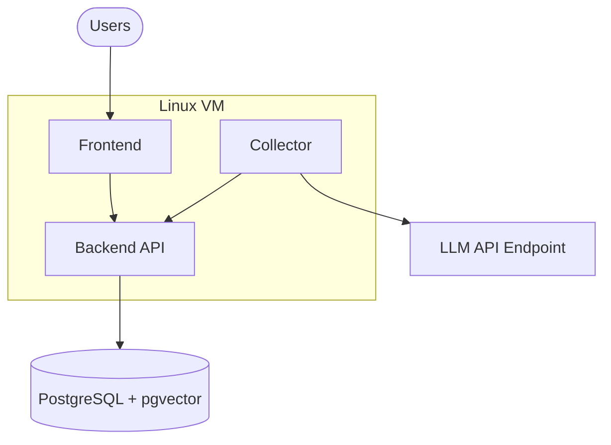

## Overview

Full on-premises deployment runs all Navigara components in your infrastructure. Source code, analysis results, and all metadata stay within your network.

## Architecture

A full deployment consists of three infrastructure components:

1. **Linux VM** — runs the Navigara application (backend, frontend, collector) via Docker Compose
2. **Managed PostgreSQL** — stores all application data including vector embeddings (requires pgvector extension)
3. **LLM API endpoint** — OpenAI-compatible API for AI-powered commit analysis



## Prerequisites

### Linux VM

The VM runs all Navigara application containers via Docker Compose.

**Operating system:** Ubuntu 24.04 LTS or Debian 13+ (other systemd-based Linux distributions may work but are not officially supported)

**Required software:**
- Docker Engine 24+
- Docker Compose v2+

### Managed PostgreSQL

A managed PostgreSQL instance with the pgvector extension enabled. All major cloud providers support this:

- **AWS**: Amazon RDS for PostgreSQL with pgvector
- **GCP**: Cloud SQL for PostgreSQL with pgvector
- **Azure**: Azure Database for PostgreSQL with pgvector
- **Self-managed**: PostgreSQL 18+ with pgvector extension installed

**PostgreSQL version:** 18 (required for native UUIDv7 support via `uuidv7()`)

**Required extension:** `pgvector` — vector similarity search for knowledge graph analysis

### LLM API Endpoint

Navigara requires an OpenAI-compatible API endpoint for AI-powered commit analysis. Supported providers:

| Provider | Model | Notes |
|----------|-------|-------|
| **Google Vertex AI** | Gemini 2.5 Flash | Recommended — best cost/performance ratio |
| **Anthropic** | Claude Sonnet 4 | High quality analysis |
| **OpenAI** | GPT-4o | Widely available |

The endpoint must be reachable from the VM. For air-gapped environments, a locally hosted model with an OpenAI-compatible API (e.g. vLLM, Ollama) can be used — contact support for guidance.

### Network Requirements

The VM must have outbound access to the following services. Ensure your firewall rules allow these connections:

| Service | Purpose | Example endpoints |
|---------|---------|-------------------|
| **Git provider** | Repository cloning and commit fetching | `github.com`, `gitlab.com`, or your self-hosted instance |
| **Task management** | Alignment scoring via issue/task data | `api.linear.app`, `*.atlassian.net`, or your self-hosted instance |
| **LLM API** | AI-powered commit analysis | `api.openai.com`, `api.anthropic.com`, or Vertex AI endpoints |

<Warning>
  If any of these services are unreachable, the corresponding Navigara features will not function. Git provider access is required for core functionality.
</Warning>

## Hardware Requirements

<Tabs>
  <Tab title="Small (up to 500K commits)">
    Suitable for small to mid-size engineering teams.

    | Component | CPU | Memory | Disk |
    |-----------|-----|--------|------|
    | **Linux VM** | 8 vCPU | 16 GB | 500 GB SSD |
    | **PostgreSQL** | 8 vCPU | 32 GB | 500 GB SSD |

  </Tab>
  <Tab title="Medium (up to 5M commits)">
    Suitable for larger organizations with multiple teams and repositories.

    | Component | CPU | Memory | Disk |
    |-----------|-----|--------|------|
    | **Linux VM** | 12 vCPU | 24 GB | 1 TB SSD |
    | **PostgreSQL** | 16 vCPU | 64 GB | 1 TB SSD |

  </Tab>
  <Tab title="Large (up to 50M commits)">
    Suitable for enterprises with extensive Git history across many repositories.

    | Component | CPU | Memory | Disk |
    |-----------|-----|--------|------|
    | **Linux VM** | 24 vCPU | 48 GB | 2 TB SSD |
    | **PostgreSQL** | 32 vCPU | 128 GB | 2 TB SSD |

  </Tab>
</Tabs>

<Note>
  Disk requirements are primarily driven by knowledge graph data and vector embeddings. SSD storage is required for acceptable query performance.
</Note>

## Installation

### 1. Prepare the VM

```bash
# Install Docker
curl -fsSL https://get.docker.com | sh
sudo usermod -aG docker $USER

# Install Docker Compose plugin (if not included)
sudo apt-get install docker-compose-plugin

# Verify
docker compose version
```

### 2. Configure the deployment

Create a directory for the Navigara deployment and download the Docker Compose configuration:

```bash
mkdir -p /opt/navigara && cd /opt/navigara
```

Create a `.env` file with your configuration:

```bash
# Database
DATABASE_URL=postgresql://navigara:<password>@<postgres-host>:5432/navigara?sslmode=require

# LLM Configuration
LLM_PROVIDER=openai          # openai | genai | anthropic
LLM_MODEL=gpt-4o             # Model name for your provider
LLM_API_KEY=<your-api-key>   # API key for the LLM provider
LLM_API_URL=                  # Custom endpoint URL (optional, for self-hosted models)

# Application
DOMAIN=navigara.yourcompany.com
GRPC_PORT=9090
HTTP_PORT=8080

# Collector
ENABLE_AGENTS=true
```

### 3. Configure PostgreSQL

Connect to your PostgreSQL instance and create the database:

```sql
CREATE DATABASE navigara;
\c navigara
CREATE EXTENSION IF NOT EXISTS vector;
```

Navigara runs database migrations automatically on startup — no manual schema setup is needed.

### 4. Start Navigara

```bash
docker compose up -d
```

Verify all services are running:

```bash
docker compose ps
```

### 5. Access the application

Open `https://navigara.yourcompany.com` in your browser. The first user to sign up becomes the organization owner.

## TLS / Certificates

For production deployments, TLS termination should be configured at the reverse proxy level. Navigara supports being placed behind:

- **Nginx** or **Caddy** as a reverse proxy
- **Cloud load balancers** (ALB, Cloud Load Balancing, Azure Application Gateway)

Example Caddy configuration:

```
navigara.yourcompany.com {
    reverse_proxy localhost:3000
}
```

Caddy automatically provisions and renews TLS certificates via Let's Encrypt.

## Backup and Restore

### Database backup

Back up your PostgreSQL database regularly using `pg_dump`:

```bash
pg_dump -h <postgres-host> -U navigara -d navigara -Fc > navigara_backup_$(date +%Y%m%d).dump
```

### Database restore

```bash
pg_restore -h <postgres-host> -U navigara -d navigara --clean navigara_backup.dump
```

<Warning>
  The database contains all application state. Ensure backups are stored securely and tested regularly.
</Warning>

## Monitoring and Health Checks

Navigara exposes health check endpoints:

| Endpoint | Description |
|----------|-------------|
| `GET /healthz` | Application health |
| `GET /readyz` | Readiness (database connectivity) |

Use these with your monitoring system (Prometheus, Datadog, etc.) to track service availability.

## Upgrades

To upgrade Navigara:

```bash
cd /opt/navigara

# Pull the latest images
docker compose pull

# Restart with new images
docker compose up -d
```

Database migrations run automatically on startup. Always back up your database before upgrading.

## Troubleshooting

| Issue | Solution |
|-------|----------|
| Database connection refused | Verify `DATABASE_URL` and that the PostgreSQL instance allows connections from the VM's IP |
| pgvector extension missing | Run `CREATE EXTENSION IF NOT EXISTS vector;` as a superuser on the database |
| LLM analysis failing | Verify `LLM_API_KEY` and that the VM can reach the LLM API endpoint |
| High disk usage | Check knowledge graph data growth; consider scaling to a larger instance tier |
| Migrations stuck | Run the migration lock cleanup script: `docker compose exec backend /app/scripts/clear-migration-locks.sh` |
