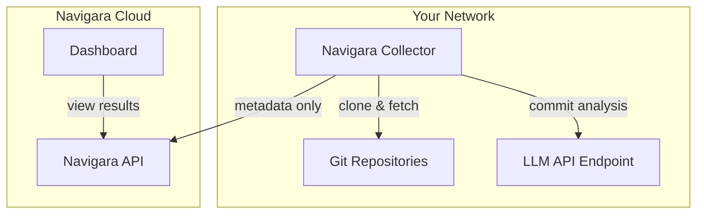

## Overview

The on-prem collector is a lightweight agent that runs within your network. It clones repositories, analyzes commits using an LLM, and streams only structured metadata (knowledge graphs, summaries, metrics) back to the Navigara cloud. **Source code never leaves your infrastructure.**



The collector connects to the Navigara API over a persistent gRPC stream. It receives work assignments (which repos/commits to analyze), processes them locally, and sends back structured results. If the connection drops, it automatically reconnects with exponential backoff and replays any buffered results.

## Prerequisites

- **Docker Engine 24+** and **Docker Compose v2+** on a Linux host (Ubuntu 24.04 LTS or Debian 13+ recommended)
- **Network access** to your Git repositories (GitHub, GitLab, Bitbucket, or self-hosted)
- **Outbound HTTPS** to the Navigara API (`app.navigara.com:443`)
- **LLM API endpoint** — see [LLM Configuration](#llm-configuration) below

### Hardware Requirements

| Scale | CPU | Memory | Disk |
|-------|-----|--------|------|
| **Small** (up to 500K commits) | 4 vCPU | 16 GB | 200 GB SSD |
| **Medium** (up to 5M commits) | 8 vCPU | 32 GB | 500 GB SSD |
| **Large** (up to 50M commits) | 16 vCPU | 64 GB | 1 TB SSD |

<Note>
  Disk is used for temporary Git clones during analysis. The collector caches cloned repositories to speed up subsequent analyses — SSD storage is recommended.
</Note>

## Git Provider Authentication

The collector supports multiple authentication methods depending on your Git provider and security requirements. You can combine methods — for example, use the Navigara GitHub App for some repositories and a personal access token for others.

### Option 1: Navigara GitHub App (Recommended for GitHub)

Install the [Navigara GitHub App](https://github.com/apps/navigara) on your GitHub organization. The Navigara cloud automatically generates short-lived installation tokens and sends them to the collector over the gRPC stream. No static credentials are stored on the collector.

**How it works:**
1. Install the Navigara GitHub App on your GitHub organization (or specific repositories)
2. Add the repositories in the Navigara dashboard
3. The backend generates scoped installation tokens on demand and sends them to the collector
4. Tokens are short-lived and automatically rotated

**Advantages:**
- No static tokens to manage or rotate
- Fine-grained repository access (select specific repos during app installation)
- Works with both GitHub.com and GitHub Enterprise

<Info>
  This is the recommended approach for GitHub users.
</Info>

### Option 2: Personal Access Token (All Providers)

Pass a personal access token (PAT) directly to the collector via environment variables. The collector uses this token for all Git operations (clone, fetch) and API calls (repo discovery, PR fetching, user lookup).

<Tabs>
  <Tab title="GitHub">
    Create a [fine-grained personal access token](https://github.com/settings/tokens?type=beta) with the following permissions:
    - **Repository access**: Select the repositories you want to analyze
    - **Permissions**: `Contents` (read), `Pull requests` (read), `Metadata` (read)

    Set the token in your `.env` file:
    ```bash
    GITHUB_TOKEN=github_pat_xxxxxxxxxxxx
    ```
  </Tab>
  <Tab title="GitLab">
    Create a [personal access token](https://docs.gitlab.com/ee/user/profile/personal_access_tokens.html) with `api` scope.

    For self-hosted GitLab, also set the instance URL in the Navigara dashboard when adding the repository.

    Set the token in your `.env` file:
    ```bash
    GITLAB_TOKEN=glpat-xxxxxxxxxxxx
    ```
  </Tab>
  <Tab title="Bitbucket">
    Create an [app password](https://support.atlassian.com/bitbucket-cloud/docs/app-passwords/) or workspace access token with `repository:read` and `pullrequest:read` permissions.

    Configure the token in the Navigara dashboard when connecting your Bitbucket workspace.
  </Tab>
</Tabs>

**Advantages:**
- Simple setup — just one environment variable
- Works with any Git provider (GitHub, GitLab, Bitbucket, self-hosted)
- Full control over token scope and lifetime

<Warning>
  Personal access tokens are long-lived credentials. Store them securely and rotate them according to your organization's security policy.
</Warning>

### Option 3: Cloud-Managed Tokens

Add Git provider tokens directly in the Navigara dashboard (Settings → Integrations). The Navigara backend securely stores the tokens and sends them to the collector on demand over the encrypted gRPC stream.

**How it works:**
1. Add your Git provider token in the Navigara dashboard
2. The backend stores the token encrypted at rest
3. When the collector needs to access a repository, the backend sends the token over the gRPC stream
4. The collector uses the token for that specific operation, then discards it

**Advantages:**
- Tokens are managed centrally in the dashboard
- No secrets stored on the collector host
- Supports all providers (GitHub, GitLab, Bitbucket)

<Note>
  Cloud-managed tokens and environment variable tokens can be used together. Environment variable tokens act as a fallback when no cloud-managed token matches a repository URL.
</Note>

## Installation

### 1. Prepare the host

```bash
# Install Docker
curl -fsSL https://get.docker.com | sh
sudo usermod -aG docker $USER

# Install Docker Compose plugin (if not included)
sudo apt-get install docker-compose-plugin

# Verify
docker compose version
```

### 2. Generate a Collector API Token

In the Navigara dashboard, go to **Settings → API Tokens** and create a new API token. This token authenticates the collector with the Navigara backend. Copy it — you'll need it in the next step.

### 3. Configure the deployment

Create the deployment directory:

```bash
mkdir -p /opt/navigara && cd /opt/navigara
```

Create `docker-compose.yml`:

```yaml
services:
  collector:
    image: ${COLLECTOR_IMAGE:-europe-docker.pkg.dev/navigara-images/public/vision-collector:${NAVIGARA_VERSION}}
    container_name: navigara-collector
    init: true
    env_file:
      - .env
    environment:
      SERVER_ADDR: ${SERVER_ADDR:-app.navigara.com:443}
      COLLECTOR_TLS: "true"
      COLLECTOR_ID: ${COLLECTOR_ID:-collector-1}
      COLLECTOR_API_KEY: ${COLLECTOR_API_KEY}
      MAX_WORKERS: ${COLLECTOR_MAX_WORKERS:-10}
      LLM_PROVIDER: ${LLM_PROVIDER:-anthropic}
      LLM_MODEL: ${LLM_MODEL:-claude-sonnet-4-20250514}
      WORK_DIR: /tmp/git-analysis
    volumes:
      - collector-workdir:/tmp/git-analysis
      # Uncomment if using Vertex AI with a service account key file
      # - ./vertex-ai-key.json:/etc/navigara/vertex-ai-key.json:ro
    restart: unless-stopped

volumes:
  collector-workdir:
    name: navigara-collector-workdir
```

Create a `.env` file:

```bash
# Version
NAVIGARA_VERSION=0.9.2

# Collector image (override to use your own registry)
# COLLECTOR_IMAGE=your-registry.example.com/navigara/vision-collector:${NAVIGARA_VERSION}

# Collector authentication (generate in Navigara dashboard → Settings → API Tokens)
COLLECTOR_API_KEY=<your-collector-api-token>

# Collector identity (optional — defaults to container hostname if not set)
# COLLECTOR_ID=collector-1

# LLM Configuration — see "LLM Configuration" section below for all providers
LLM_PROVIDER=anthropic             # anthropic (recommended) | openai | genai
LLM_MODEL=claude-sonnet-4-20250514 # Model name for your provider
LLM_API_KEY=<your-llm-api-key>    # API key for the LLM provider
LLM_API_URL=                       # Custom endpoint URL (optional, for self-hosted models)

# OpenAI (uncomment if using openai provider)
# LLM_PROVIDER=openai
# LLM_MODEL=gpt-5.4
# LLM_API_KEY=<your-openai-api-key>

# Google Vertex AI (uncomment if using genai provider)
# LLM_PROVIDER=genai
# LLM_MODEL=gemini-2.5-flash
# GOOGLE_PROJECT=<your-gcp-project>
# GOOGLE_LOCATION=global
# GOOGLE_APPLICATION_CREDENTIALS=/etc/navigara/vertex-ai-key.json  # Required if host is not authenticated via gcloud

# Git provider tokens (optional — see "Git Provider Authentication" above)
# GITHUB_TOKEN=github_pat_xxxxxxxxxxxx
# GITLAB_TOKEN=glpat-xxxxxxxxxxxx

# Concurrency (default: 10 parallel workers)
# COLLECTOR_MAX_WORKERS=10
```

## LLM Configuration

Navigara requires an LLM API endpoint for AI-powered commit analysis. Supported providers:

| Provider | Model | Notes |
|----------|-------|-------|
| **Anthropic** | Claude Sonnet / Claude Haiku | Recommended — best quality/cost ratio |
| **Google Vertex AI** | Gemini 2.5 Flash | Good cost/performance ratio |
| **OpenAI** | GPT-5.4 | Widely available |

<Tabs>
  <Tab title="Anthropic (Recommended)">
    ```bash
    LLM_PROVIDER=anthropic
    LLM_MODEL=claude-sonnet-4-20250514    # or claude-haiku-4-5-20251001
    LLM_API_KEY=<your-anthropic-api-key>
    ```

    Claude Sonnet is recommended for the best analysis quality. Claude Haiku is a cost-effective alternative with faster throughput.
  </Tab>
  <Tab title="Google Vertex AI">
    Vertex AI uses GCP service account authentication instead of a static API key.

    **1. Create a GCP service account** with the `Vertex AI User` role in your GCP project.

    **2. Download the service account key file** (e.g., `vertex-ai-key.json`) and place it on the host.

    **3. Set the following in your `.env` file:**

    ```bash
    LLM_PROVIDER=genai
    LLM_MODEL=gemini-2.5-flash
    GOOGLE_PROJECT=<your-gcp-project>
    GOOGLE_LOCATION=global
    GOOGLE_APPLICATION_CREDENTIALS=/etc/navigara/vertex-ai-key.json
    ```

    **4. Mount the key file** in your `docker-compose.yml`:

    ```yaml
    volumes:
      - ./vertex-ai-key.json:/etc/navigara/vertex-ai-key.json:ro
    ```
  </Tab>
  <Tab title="OpenAI">
    ```bash
    LLM_PROVIDER=openai
    LLM_MODEL=gpt-5.4
    LLM_API_KEY=<your-openai-api-key>
    ```
  </Tab>
  <Tab title="Self-hosted (OpenAI-compatible)">
    Any model served behind an OpenAI-compatible API (e.g., vLLM, Ollama) can be used:

    ```bash
    LLM_PROVIDER=openai
    LLM_MODEL=<your-model-name>
    LLM_API_KEY=<your-api-key>        # May be optional depending on your setup
    LLM_API_URL=http://<your-host>:8000/v1
    ```
  </Tab>
</Tabs>

### 4. Start the collector

```bash
docker compose up -d
```

Verify the collector is running and connected:

```bash
docker compose logs -f collector
```

You should see output indicating a successful connection:

```
connected to server at app.navigara.com:443
registered as collector-1 with 10 workers
```

### 5. Add repositories

Once the collector is running, add repositories through the Navigara dashboard:

1. Go to **Settings → Repositories → Add Repository**
2. Select your Git provider and authenticate (if using cloud-managed tokens or GitHub App)
3. Select the repositories to analyze
4. The collector will automatically begin processing

## Configuration Reference

| Variable | Default | Description |
|----------|---------|-------------|
| `SERVER_ADDR` | `app.navigara.com:443` | Navigara API gRPC address |
| `COLLECTOR_TLS` | `true` | Enable TLS for gRPC connection |
| `COLLECTOR_API_KEY` | — | API token generated in Settings → API Tokens (required) |
| `COLLECTOR_ID` | hostname | Unique identifier for this collector (defaults to container hostname) |
| `MAX_WORKERS` | `10` | Number of concurrent commit analysis workers |
| `LLM_PROVIDER` | `anthropic` | LLM provider: `anthropic`, `openai`, or `genai` |
| `LLM_MODEL` | `claude-sonnet-4-20250514` | Model name |
| `LLM_API_KEY` | — | API key for the LLM provider |
| `LLM_API_URL` | — | Custom LLM endpoint (for self-hosted models) |
| `GOOGLE_PROJECT` | — | GCP project ID (required for `genai` provider) |
| `GOOGLE_LOCATION` | `global` | GCP location (for `genai` provider) |
| `GITHUB_TOKEN` | — | GitHub PAT for repository access |
| `GITLAB_TOKEN` | — | GitLab PAT for repository access |
| `WORK_DIR` | `/tmp/git-analysis` | Directory for temporary Git clones |

## Running Multiple Collectors

You can run multiple collector instances for higher throughput or geographic distribution. Each collector must have a unique `COLLECTOR_ID`. The Navigara backend distributes work across connected collectors with affinity routing — it prefers sending work to a collector that already has a repository cached locally.

```yaml
# docker-compose.yml with two collectors
services:
  collector-1:
    image: europe-docker.pkg.dev/navigara-images/public/vision-collector:${NAVIGARA_VERSION}
    container_name: navigara-collector-1
    init: true
    env_file: .env
    environment:
      COLLECTOR_ID: collector-1
      # ... other env vars
    restart: unless-stopped

  collector-2:
    image: europe-docker.pkg.dev/navigara-images/public/vision-collector:${NAVIGARA_VERSION}
    container_name: navigara-collector-2
    init: true
    env_file: .env
    environment:
      COLLECTOR_ID: collector-2
      # ... other env vars
    restart: unless-stopped
```

## Network Requirements

The collector host must have outbound access to the following services:

| Service | Purpose | Endpoint |
|---------|---------|----------|
| **Navigara API** | Work assignment and result streaming | `app.navigara.com:443` |
| **Git provider** | Repository cloning and fetching | `github.com`, `gitlab.com`, or your self-hosted instance |
| **LLM API** | AI-powered commit analysis | `api.anthropic.com`, `api.openai.com`, or Vertex AI endpoints |

<Warning>
  No inbound ports need to be opened. The collector initiates all connections outbound.
</Warning>

## Upgrades

```bash
cd /opt/navigara

# Update NAVIGARA_VERSION in .env, then:
docker compose pull
docker compose up -d
```

The collector is stateless — it can be stopped and restarted at any time without data loss. In-progress work is automatically reassigned by the Navigara backend.

## Troubleshooting

| Issue | Solution |
|-------|----------|
| `connection refused` | Verify outbound access to `app.navigara.com:443` from the host |
| `authentication failed` | Check that `COLLECTOR_API_KEY` matches the token configured in Navigara |
| `LLM analysis failing` | Verify `LLM_API_KEY` and that the host can reach the LLM endpoint |
| Collector keeps reconnecting | Check logs for specific errors; ensure the gRPC stream is not being terminated by a proxy or firewall |
| Slow analysis | Increase `MAX_WORKERS` (ensure sufficient CPU/memory) or add a second collector |
| High disk usage | The collector caches Git clones in `WORK_DIR`; restart the container or clear the volume to reclaim space |
